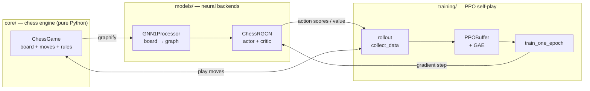

# ♟️ kAIsparov

> A research platform for teaching chess to **Graph Neural Networks** — a testbed
> for comparing GNN architectures and training methods on the same board-as-graph task.

[](https://github.com/lucastabary/kAIsparov/actions/workflows/ci.yml)
[](https://www.python.org/)
[](LICENSE)

**kAIsparov** represents a chess board as a graph — squares are nodes, legal piece
movements are typed edges — and asks how well different **Graph Neural Networks**
can learn to play it. The goal isn't a single model: it's a clean platform where
**many GNN architectures** (relational GCN today; GAT, message-passing, graph
transformers next) and **many training methods** (PPO self-play today; supervised,
DQN, AlphaZero-style search later) can be swapped in and compared on identical
footing — same engine, same evaluation, same experiment tracking.

The first backend (`gnn_v1`) is a relational GCN actor–critic trained with
**PPO self-play**. It ships with a custom, dependency-free chess engine and a
pygame interface to play against a trained agent.

> 🔬 **The deeper goal is interpretability** — not just to train a strong player,
> but to understand *what a GNN learns about chess*: what its node embeddings
> encode, how information flows along piece-relation edges, which structures it
> attends to. The `notebooks/` folder is the workspace for that analysis.

📚 **Full developer & research documentation: [docs.md](docs.md).**

---

## ✨ Highlights

- **A backend is a folder.** A typed `BackendSpec` contract + a dynamic loader mean
  a new architecture or training method drops in under `models/<name>/` and is
  instantly trainable and comparable — no changes to the engine, arena, or tracker.
- **Board-as-graph representation** — an 8×8 board becomes 64 nodes; each piece's
  movement pattern is a distinct **edge type** (relation), consumed by the model.
- **Actor–critic over edges** — the policy scores *edges* (moves) rather than
  squares, so the action space is the set of piece moves; the critic pools the
  graph into a scalar state value.
- **From-scratch chess engine** — no `python-chess` dependency; fast `make`/`unmake`,
  precomputed attack tables, perft-tested, all in plain `core/` Python.
- **Built-in evaluation & tracking** — every run is benchmarked against baselines
  (random / material) and recorded under `runs/` with full metadata, queryable via
  `kaisparov runs`.

> ⚠️ **Rule simplification.** To keep the RL problem tractable, the engine uses a
> "capture-the-king" win condition: players are not required to get out of check,
> and the game ends when a king is captured. Castling and en passant *are*
> implemented; promotion and draw rules are not. This is a research simplification,
> not a bug.

---

## 🏗️ Architecture



The seams that keep it extensible:

| Layer | Responsibility | Extension point |
|-------|----------------|-----------------|
| `core/` | Rules & board state, no ML deps | Swap in a new variant / engine |
| `envs/` | Reward / terminal / legal actions | Reward shaping, new variants |
| `models/<name>/` | Graph encoding + network | Add `gnn_v2/` with its own `BackendSpec` |
| `agents/` | Policies (random / material / neural) | New baselines or search agents |
| `training/` | Config, trainer, PPO, curriculum | Curriculum phases, algorithms |
| `eval/` | Arena: matches, win-rates, Elo | New metrics / opponents |
| `tracking/` | Run artifacts + queryable registry | New logged metrics / backends |

---

## 🚀 Getting started

Requires **Python 3.10+**. PyTorch here targets **CUDA 11.8** (CPU works too).

```bash
# 1. Clone
git clone https://github.com/lucastabary/kAIsparov.git
cd kAIsparov

# 2. Create an environment
python -m venv .venv && source .venv/bin/activate   # Windows: .venv\Scripts\activate

# 3. Install (GPU / CUDA 11.8)
pip install -r requirements.txt --extra-index-url https://download.pytorch.org/whl/cu118
# ...or CPU-only:
pip install -r requirements.txt --extra-index-url https://download.pytorch.org/whl/cpu

# 4. Install the package itself (editable)
pip install -e .
```

Everything runs through one command — `kaisparov <train|eval|play|runs>`
(equivalently `python -m kaisparov.cli <...>`). It runs comfortably on CPU.

### Train

Training is config-driven ([config/default.yaml](config/default.yaml)); CLI flags
override individual fields.

```bash
kaisparov train --config config/default.yaml
kaisparov train --epochs 100 --hidden-dim 16 --cpu   # override on top of defaults
kaisparov train --resume <run_id> --epochs 50        # continue an earlier run (CPU-friendly)
```

`--resume` (or `resume_from_run: <run_id>` in the YAML) reloads a run's **latest**
checkpoint *and* its optimizer + RNG state, so training continues exactly where it
stopped. On resume the **architecture is inherited** from the parent — you don't
redefine `model`/`hidden_dim`, just list what changes. Set `title` / `description` in
the config to document each experiment (shown by `kaisparov runs`).

Reward shaping is config-driven too: `reward: aggressive` picks a preset from
[config/rewards.yaml](config/rewards.yaml), or write the terms (`material`, `check`,
`king_capture`, `step_penalty`) inline. The resolved shaping is saved in `run.json`.

Each run creates a self-contained directory under `runs/<run_id>/` with the
resolved config, per-epoch metrics, TensorBoard logs, and checkpoints — plus a
`run.json` capturing git commit, seed, device, parameter count, the full metric
history, and the best checkpoint. During training the agent is periodically
evaluated against the baselines, so the Elo-vs-random curve is logged over time.

```bash
tensorboard --logdir runs/          # watch loss + Elo curves live
```

### Experiment tracking

Query every run you've trained, with all their metadata:

```bash
kaisparov runs list                       # all runs, newest first
kaisparov runs show <run_id>              # full metadata for one run
kaisparov runs lineage <run_id>          # the resume chain a run belongs to
kaisparov runs best --metric elo_vs_random
```

### Evaluate

Pit agents against each other and print win-rates and a rough Elo gap:

```bash
kaisparov eval --games 60                                    # baselines only
kaisparov eval --games 40 --model gnn_v1 \
    --checkpoint runs/<run_id>/checkpoints/best.pth          # include the neural agent
```

The greedy material baseline crushes the random one, which sanity-checks the
engine and arena:

```
material vs random | 59W 1L 0D | score=98.3% | elo_diff=+708
```

(The neural agent needs real training before it beats the baselines.)

### Play

```bash
kaisparov play                    # human vs human
kaisparov play --vs-ai            # vs the newest run's latest checkpoint
kaisparov play --vs-ai --best     # ...or the best-Elo checkpoint (or --checkpoint <path>)
```

Opens a pygame window; `--curriculum` starts from a training-style position.

---

## 🗂️ Project structure

```
kAIsparov/
├─ src/kaisparov/
│  ├─ core/        # chess engine: coords, board, movegen, rules, pieces, UI
│  ├─ envs/        # ChessEnv — Gym-like reset/step/reward/terminal
│  ├─ models/      # neural backends (base classes + gnn_v1) and factory
│  ├─ agents/      # policies: RandomAgent, MaterialAgent, NeuralAgent
│  ├─ eval/        # arena: play matches, win-rates, Elo
│  ├─ training/    # config, Trainer, PPO, rollout buffer (GAE), curriculum
│  ├─ tracking/    # RunManager + Registry (run artifacts)
│  ├─ cli.py       # unified entry point: kaisparov <train|eval|play|runs>
│  ├─ train.py     # training logic
│  └─ play.py      # pygame play (human vs human / vs AI)
├─ config/         # training configs: default.yaml + experiments/
├─ notebooks/      # data-science & interpretability workspace (analyze.ipynb)
├─ runs/           # per-run artifacts (git-ignored): checkpoints, metrics, TensorBoard
├─ tests/          # smoke + unit + engine tests
└─ pyproject.toml
```

---

## 🧠 How it works

1. **Encode** — `GNN1Processor.graphify` turns the board into a PyG `Data`:
   12-dim node features (6 ally piece types + 6 enemy) over a *static* graph whose
   edges encode every piece's movement geometry (6 relations).
2. **Reason** — `ChessRGCN` runs 4 relational graph-conv layers with residuals,
   producing per-node embeddings.
3. **Act** — an edge is scored from its endpoints' embeddings; illegal moves are
   masked, and a move is sampled from the resulting distribution. A critic head
   pools the graph via attention into a state value.
4. **Learn** — self-play trajectories feed a PPO buffer with GAE advantages, and
   `train_one_epoch` runs clipped policy + value + entropy updates.

`gnn_v1` is one point in this space. The architecture (how nodes reason) and the
training method (how the policy learns) are independent axes you can vary.

---

## 🧩 Adding a model backend

A backend is a self-contained folder `models/<name>/` exposing a `BACKEND_SPEC`.
To try a new GNN (say a graph-attention net) or a new learner:

```python
# models/gnn_v2/__init__.py
BACKEND_SPEC = BackendSpec(
    name="gnn_v2",
    model_class=GNN2Model,  # your nn.Module (any GNN architecture)
    processor_class=GNN2Processor,  # board -> graph encoding
    buffer_class=PPOBuffer,  # or a different learner's buffer
    collect_data=collect_data,  # how experience is gathered
    train_one_epoch=train_one_epoch,
)
```

Register it in `models/factory.py`, then everything else — self-play, the arena,
Elo evaluation, run tracking — works unchanged:

```bash
kaisparov train --model gnn_v2
kaisparov eval  --model gnn_v2 --checkpoint runs/<id>/checkpoints/best.pth
```

The engine, environment, agents, and tracker never need to know which model is
running, which is what makes architecture-vs-architecture comparison clean.

---

## 🗺️ Roadmap

- [x] **Phase 0** — working PPO self-play loop (buffer, rollout, curriculum, trainer)
- [x] **Phase 1** — packaging, pinned deps, README, linting, CI
- [x] **Phase 2** — pure/fast engine core: `make`/`unmake`, precomputed attack tables, perft tests
- [x] **Phase 3** — `ChessEnv` (Gym-like) + baseline agents (random / material) + evaluation arena
- [x] **Phase 4** — config-driven `Trainer`, TensorBoard, negamax self-play credit, periodic Elo eval, run tracking + registry
- [x] **Phase 5** — unified `kaisparov` CLI (`train` / `eval` / `play` / `runs`), Elo evaluation vs baselines
- [ ] **Next** — longer training runs to actually beat the baselines; a second GNN backend (`gnn_v2`)

---

## 📄 License

Released under the [MIT License](LICENSE).
